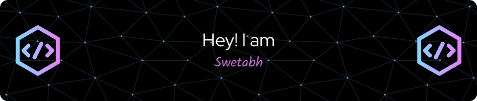

<h3 align="center">A passionate backend developer from India</h3>

- 🌱 I’m currently learning **Go**

- 👯 I’m looking to collaborate on **Backend and Full-Stack Projects**

- 🤝 I’m looking for help with **Backend and Full-Stack Projects**

- 👨‍💻 All of my projects are available at [https://swetabh.vercel.app/](https://swetabh.vercel.app/)

- 💬 Ask me about **Backend Development**

- 📫 How to reach me **swetabhshreyam333@gmail.com**

- 📄 Know about my experiences [https://drive.google.com/file/d/1ipNeu6mYq6_rY_Ewa_ZIRQ4txUFt_YTs/view?usp=drive_link](https://drive.google.com/file/d/1ipNeu6mYq6_rY_Ewa_ZIRQ4txUFt_YTs/view?usp=drive_link)

<h3 align="left">Connect with me:</h3>

<h3 align="left">Languages and Tools:</h3>

                          

  

